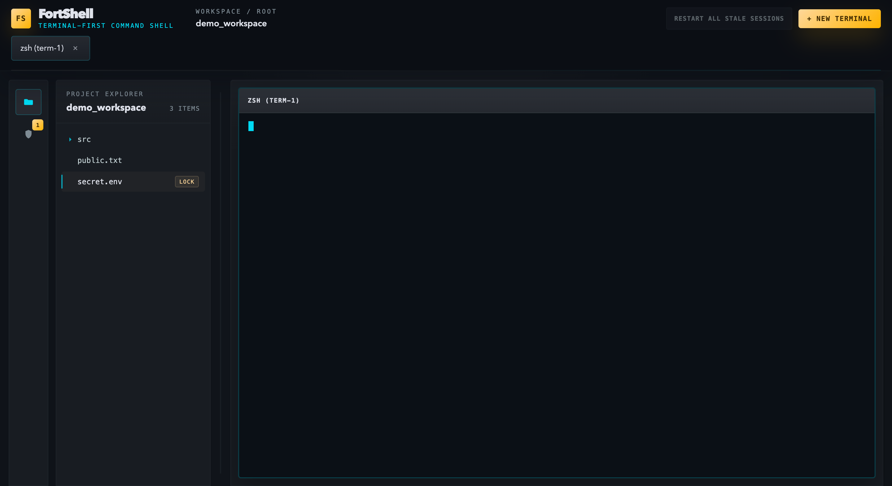

# FortShell

A terminal-first IDE for managing multiple AI CLI tools (Claude Code, Codex CLI, Gemini CLI, etc.) with **kernel-level file protection**.

Protect sensitive files from AI agents — they can see the files exist, but can't read or write them. Enforced by the macOS kernel, not by the app. No admin privileges required.



## Why?

When you use AI coding assistants in a terminal, they can read and modify any file in your project. FortShell lets you **set boundaries**:

1. Open your project folder
2. Right-click sensitive files (credentials, .env, proprietary code) → **Protect**
3. Open AI CLI terminals — they run inside a macOS sandbox
4. Protected files return `Operation not permitted` — the AI adapts and works around them

```
$ cat .env
cat: .env: Operation not permitted

$ python3 -c "open('.env').read()"
PermissionError: [Errno 1] Operation not permitted: '.env'
```

## Features

### Terminal Management
- **Multi-terminal tabs** — run multiple AI CLIs side by side
- **Split layouts** — horizontal, vertical, 2-column grid
- **Shell profiles** — auto-detects zsh, bash, fish + add custom shells (node, python3, etc.)
- **xterm.js** rendering with full color, resize, and interactive program support

### File Protection
- **Kernel-level enforcement** — enforced by the OS, not the app
- **Per-file or per-folder** — protect individual files or entire directories
- **Transparent to the user** — protected files show a lock icon in the file tree
- **Cannot be bypassed** by the sandboxed process — not even with python, node, or symlinks

| Access method | Blocked? |
|---|---|
| `cat`, `head`, `tail`, `less` | Yes |
| `python3`, `node`, `ruby` | Yes |
| Symlink traversal | Yes |
| Shell builtins (`< file`) | Yes |
| `git show`, `git cat-file` | **No** |

### File Tree
- **Lazy-loaded** — folders expand on click, no depth limit
- **.gitignore** aware — respects your ignore patterns
- **File watcher** — auto-refreshes when files change
- **Context menu** — right-click to protect/unprotect

### Settings
- **Menu bar** → FortShell → Settings, or **Cmd+,**
- Font size (live preview), default shell, layout, sidebar width
- **Custom shell profiles** — add any CLI tool as a terminal option

## Installation

### Option 1: From Source (developers)

**Prerequisites**
- **Node.js** 20+
- **macOS** (primary platform)
- **Xcode Command Line Tools**: `xcode-select --install`

```bash
# Clone
git clone https://github.com/your-username/fortshell.git
cd fortshell

# Install dependencies
npm install

# Rebuild native modules for Electron
npx electron-rebuild -f -w node-pty

# Compile sandbox wrapper (macOS only)
cc -o native/darwin/sandbox-wrapper native/darwin/sandbox-wrapper.c -Wall -O2

# Run
npm run dev
```

### Option 2: Download (end users)

Download from [GitHub Releases](https://github.com/evergreen96/FortShell/releases).

```bash
# 1. Unzip and move to Applications
unzip FortShell-*.zip -d /Applications

# 2. Allow unsigned app (required once)
xattr -cr /Applications/FortShell.app

# 3. Launch
open /Applications/FortShell.app
```

Or via System Settings → Privacy & Security → "Open Anyway".

---

## Usage

### Getting Started

1. Launch FortShell → **Open Folder** → select your project
2. A terminal opens automatically in the project directory
3. Click **+ New** to add more terminals (or choose a specific shell)

### Protecting Files

1. In the file tree, **right-click** a file or folder → **Protect**
2. A lock icon appears on the protected item
3. Click the **↻ icon** on the terminal tab to restart with new policy
4. The terminal now runs inside a macOS sandbox:

```
$ cat .env
cat: .env: Operation not permitted

$ python3 -c "open('.env').read()"
PermissionError: [Errno 1] Operation not permitted: '.env'
```

5. To remove protection: right-click → **Remove Protection**

### Settings

Open via **menu bar → FortShell → Settings** or **Cmd+,**

- Font size (applies to all terminals immediately)
- Default shell
- Default layout
- Sidebar width
- Custom shell profiles (add any CLI tool: `node`, `python3`, `/opt/homebrew/bin/fish`, etc.)

---

## Keyboard Shortcuts

| Shortcut | Action |
|---|---|
| Cmd+, | Settings |
| Cmd+B | Toggle sidebar |
| Ctrl+\` | Focus terminal |
| Ctrl+Shift+\` | New terminal |
| Ctrl+Tab | Next terminal |
| Ctrl+W | Close terminal |
| Ctrl+1 / 2 / 3 | Horizontal / Vertical / Grid layout |
| Cmd+Option+I | Developer Tools |

## Test

```bash
npm run test          # Unit tests (vitest)
npm run test:e2e      # E2E tests (Playwright + Electron)
```

## Tech Stack

| Component | Technology |
|---|---|
| Desktop framework | Electron |
| Language | TypeScript |
| Frontend | React + Vite |
| Terminal rendering | xterm.js |
| Terminal backend | node-pty |
| File protection | macOS kernel sandbox |
| Unit tests | vitest |
| E2E tests | Playwright |
| Packaging | electron-builder |

## Platform Support

| Platform | Status |
|---|---|
| **macOS** | Supported |
| **Linux** | Planned |
| **Windows** | Under investigation |

## License

AGPL-3.0 — see [LICENSE](./LICENSE) for details.
